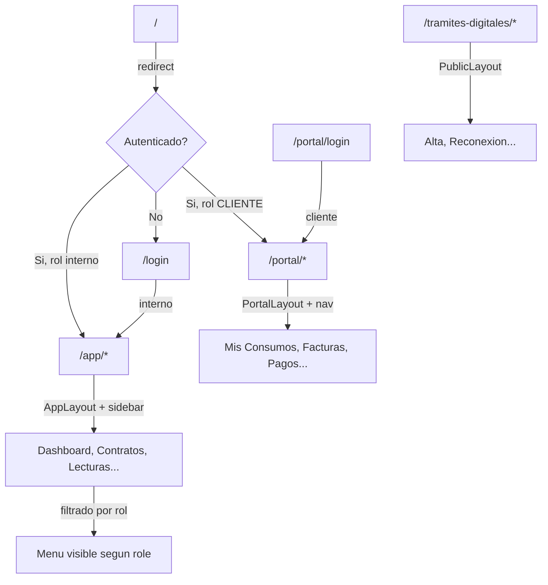

# Arquitectura de Routing Multi-Contexto

## Situacion actual

- React Router DOM v6 con rutas planas en [App.tsx](frontend/src/App.tsx)
- Dos layouts: `AppLayout` (sidebar admin) y `PortalLayout` (header publico)
- Sin auth guards en frontend
- Sin roles en modelo User (solo `administracionIds` y `zonaIds`)
- Backend con JWT auth pero sin concepto de roles

## Arquitectura propuesta

**Tres grupos de rutas por CONTEXTO** (no por rol):




**Por que contexto y no por rol:**

- Un ADMIN y un OPERADOR ven la misma pantalla `/app/contratos` (con diferentes permisos CRUD), no `/admin/contratos` vs `/operador/contratos`
- El sidebar del `AppLayout` se filtra dinamicamente segun el rol del usuario
- URLs compartibles entre usuarios internos sin importar su rol
- Los componentes de pagina se reusan; la autorizacion granular se maneja via API

## Roles propuestos


| Rol                 | Contexto  | Descripcion                           |
| ------------------- | --------- | ------------------------------------- |
| `SUPER_ADMIN`       | /app/*    | Acceso total                          |
| `ADMIN`             | /app/*    | Gestion completa de su administracion |
| `OPERADOR`          | /app/*    | Infraestructura + servicios           |
| `LECTURISTA`        | /app/*    | Solo rutas y lecturas                 |
| `ATENCION_CLIENTES` | /app/*    | Contratos, recibos, pagos, atencion   |
| `CLIENTE`           | /portal/* | Portal de clientes                    |


---

## Cambios en Backend

### T1 -- Agregar rol al modelo User

**Archivo:** [backend/prisma/schema.prisma](backend/prisma/schema.prisma)

Agregar enum `UserRole` y campo `role` al modelo `User`:

```prisma
enum UserRole {
  SUPER_ADMIN
  ADMIN
  OPERADOR
  LECTURISTA
  ATENCION_CLIENTES
  CLIENTE
}

model User {
  // ... campos existentes ...
  role  UserRole @default(OPERADOR)
}
```

Crear migracion Prisma para el cambio.

### T2 -- Incluir role en JWT y AuthService

**Archivos:**

- [backend/src/auth/auth.service.ts](backend/src/auth/auth.service.ts)
- [backend/src/auth/jwt.strategy.ts](backend/src/auth/jwt.strategy.ts)
- Incluir `role` en el payload del JWT al hacer login
- Extraer `role` en la estrategia JWT para que este disponible en `req.user`

### T3 -- Decorator y Guard de roles (backend)

**Nuevos archivos:**

- `backend/src/auth/roles.decorator.ts` -- Decorator `@Roles('ADMIN', 'OPERADOR')`
- `backend/src/auth/roles.guard.ts` -- Guard que valida el rol del JWT contra los roles permitidos

Patron estandar de NestJS:

```typescript
@Roles('ADMIN', 'SUPER_ADMIN')
@UseGuards(JwtAuthGuard, RolesGuard)
@Get('contratos')
findAll() { ... }
```

### T4 -- Actualizar seed con roles

**Archivo:** [backend/prisma/seed.ts](backend/prisma/seed.ts)

Agregar `role: 'SUPER_ADMIN'` al usuario demo y crear usuarios de ejemplo para cada rol.

---

## Cambios en Frontend

### T5 -- Crear AuthContext y hook useAuth

**Nuevo archivo:** `frontend/src/context/AuthContext.tsx`

- Manejo de JWT token (`ctcf_access_token` en localStorage)
- Estado: `user | null`, `isLoading`, `isAuthenticated`
- Funciones: `login(email, password)`, `logout()`
- Decodifica JWT para obtener `role`, `name`, `email`
- Provee `user.role` a toda la app

### T6 -- Crear componentes de guard de rutas

**Nuevos archivos:**

- `frontend/src/components/auth/ProtectedRoute.tsx` -- Requiere autenticacion, redirige a login
- `frontend/src/components/auth/RoleGate.tsx` -- Verifica que el rol del usuario este en la lista permitida

```typescript
<ProtectedRoute requiredRoles={['ADMIN', 'SUPER_ADMIN']}>
  <Outlet />
</ProtectedRoute>
```

### T7 -- Crear pagina de Login (interno)

**Nuevo archivo:** `frontend/src/pages/auth/Login.tsx`

- Formulario email/password
- Llama a `POST /api/auth/login`
- Redirige a `/app` on success
- Usa shadcn/ui components

### T8 -- Crear pagina de Login (portal/cliente)

**Nuevo archivo:** `frontend/src/pages/portal/PortalLogin.tsx`

- Formulario con estilo del portal (usa PortalLayout)
- Llama al mismo endpoint `/api/auth/login` (el role viene en el JWT)
- Redirige a `/portal` on success

### T9 -- Reestructurar App.tsx con router config

**Archivo:** [frontend/src/App.tsx](frontend/src/App.tsx)

Reestructurar completamente:

```
/                           -> Redirect a /app o /login
/login                      -> Login interno
/app/*                      -> ProtectedRoute(roles internos) + AppLayout
  /app                      -> Dashboard
  /app/factibilidades       -> Factibilidades
  /app/contratos            -> Contratos
  ... (todas las paginas actuales con prefijo /app)
/portal/login               -> PortalLogin
/portal/*                   -> ProtectedRoute(CLIENTE) + PortalLayout
  /portal                   -> PortalCliente (dashboard)
  /portal/consumos          -> Sub-pagina consumos
  /portal/facturas          -> Sub-pagina facturas
  ... (expandir tabs del portal a rutas reales)
/tramites-digitales/*       -> PublicLayout (sin auth)
  /tramites-digitales       -> TramitesDigitales
*                           -> NotFound
```

Usar `React.lazy()` para code-splitting por grupo de rutas.

### T10 -- Definir mapa de permisos de rutas

**Nuevo archivo:** `frontend/src/config/routes.ts`

Configuracion centralizada de rutas con metadata:

```typescript
export const APP_ROUTES = [
  { path: 'dashboard', roles: ['SUPER_ADMIN', 'ADMIN', 'OPERADOR', 'LECTURISTA', 'ATENCION_CLIENTES'] },
  { path: 'factibilidades', roles: ['SUPER_ADMIN', 'ADMIN', 'OPERADOR'] },
  { path: 'lecturas', roles: ['SUPER_ADMIN', 'ADMIN', 'OPERADOR', 'LECTURISTA'] },
  // ...
];
```

### T11 -- Actualizar AppLayout sidebar con filtro por rol

**Archivo:** [frontend/src/components/AppLayout.tsx](frontend/src/components/AppLayout.tsx)

- Importar `useAuth()` en lugar del mock user selector
- Filtrar `navGroups` segun `user.role` usando el mapa de permisos
- Reemplazar el selector de usuario mock por info real del usuario autenticado
- Agregar boton de logout

### T12 -- Actualizar PortalLayout con navegacion de cliente

**Archivo:** [frontend/src/components/PortalLayout.tsx](frontend/src/components/PortalLayout.tsx)

- Agregar navegacion horizontal (tabs/nav) para las secciones del portal
- Agregar info del cliente autenticado y boton logout
- Links a: Dashboard, Consumos, Facturas, Recibos, Metodos de Pago, Tramites

### T13 -- Actualizar NavLinks internos

Actualizar todos los `NavLink` y links duros que apuntan a rutas antiguas (ej. `/contratos` -> `/app/contratos`).

---

## Estructura de archivos resultante

```
frontend/src/
  config/
    routes.ts              (mapa de rutas + roles)
  context/
    AuthContext.tsx         (nuevo)
    DataContext.tsx         (existente)
  components/
    auth/
      ProtectedRoute.tsx   (nuevo)
      RoleGate.tsx         (nuevo)
    AppLayout.tsx           (modificado)
    PortalLayout.tsx        (modificado)
  pages/
    auth/
      Login.tsx            (nuevo)
    portal/
      PortalLogin.tsx      (nuevo)
    Dashboard.tsx           (existente)
    Contratos.tsx           (existente)
    PortalCliente.tsx       (existente, modificado)
    TramitesDigitales.tsx   (existente)
    ... (demas paginas sin mover)
```

---

## Lo que NO cambia (guardrails)

- Los componentes de pagina existentes no se mueven de carpeta (solo se agregan nuevos)
- El DataContext sigue funcionando igual
- Los componentes de UI (shadcn) no se tocan
- El backend no cambia endpoints existentes, solo agrega role y guards
- TramitesDigitales sigue siendo publico

---

## Execution Pack for Executor

### 0) Context Packet

- **Repo**: Monorepo JS/TS. Frontend: React 18 + Vite + React Router DOM v6. Backend: NestJS + Prisma + PostgreSQL.
- **Commands**: `npm run dev:frontend`, `npm run dev:backend`, `npx prisma migrate dev`, `npx prisma generate`, `npm run build`
- **Constraints**: No romper funcionalidad existente. Rutas antiguas deben redirigir o seguir funcionando.
- **Conventions**: shadcn/ui para UI, Tailwind CSS, path alias `@/` = `src/`

### 0.1) Tooling

- Sequential Thinking para decisiones arquitecturales
- Memory MCP para guardar decisiones
- Context7 si se necesita documentacion de React Router v6 o NestJS guards

### 1) Task Contracts

**T1 -- Prisma role enum + migration**

- Goal: Agregar enum UserRole y campo role al modelo User
- Touchpoints: `backend/prisma/schema.prisma`
- Steps: Agregar enum, agregar campo, correr `npx prisma migrate dev --name add_user_role`
- Done: Migration exitosa, `npx prisma generate` sin errores
- Guardrails: No modificar otros modelos

**T2 -- JWT payload con role**

- Goal: Incluir role en JWT token
- Inputs: T1 completado
- Touchpoints: `backend/src/auth/auth.service.ts`, `backend/src/auth/jwt.strategy.ts`
- Done: Login retorna JWT con role en payload, `/api/auth/me` retorna role

**T3 -- Roles decorator y guard (backend)**

- Goal: Crear @Roles decorator y RolesGuard
- Touchpoints: Nuevos archivos en `backend/src/auth/`
- Done: Guard funcional, puede proteger endpoints por rol

**T4 -- Seed con roles**

- Goal: Actualizar seed para incluir roles variados
- Touchpoints: `backend/prisma/seed.ts`
- Done: `npx prisma db seed` crea usuarios con diferentes roles

**T5 -- AuthContext frontend**

- Goal: Contexto de autenticacion con JWT
- Touchpoints: Nuevo `frontend/src/context/AuthContext.tsx`
- Done: `useAuth()` retorna user, isAuthenticated, login(), logout()

**T6 -- ProtectedRoute y RoleGate**

- Goal: Componentes de guard de rutas
- Touchpoints: Nuevos en `frontend/src/components/auth/`
- Done: Componentes renderizan hijos o redirigen segun auth/rol

**T7 -- Login interno**

- Goal: Pagina de login para usuarios internos
- Touchpoints: Nuevo `frontend/src/pages/auth/Login.tsx`
- Done: Login funcional con redirect a /app

**T8 -- Portal Login**

- Goal: Pagina de login para clientes
- Touchpoints: Nuevo `frontend/src/pages/portal/PortalLogin.tsx`
- Done: Login funcional con redirect a /portal

**T9 -- Reestructurar App.tsx**

- Goal: Nuevo arbol de rutas con prefijos /app, /portal, /tramites-digitales
- Inputs: T5, T6, T7, T8
- Touchpoints: `frontend/src/App.tsx`
- Done: Todas las rutas funcionan bajo nuevos prefijos, lazy loading activo

**T10 -- Mapa de permisos**

- Goal: Config centralizada de rutas y roles permitidos
- Touchpoints: Nuevo `frontend/src/config/routes.ts`
- Done: Exporta constantes usadas por sidebar y guards

**T11 -- AppLayout con filtro por rol**

- Goal: Sidebar muestra solo items permitidos para el rol del usuario
- Inputs: T5, T10
- Touchpoints: `frontend/src/components/AppLayout.tsx`
- Done: Sidebar filtrado, mock user selector reemplazado

**T12 -- PortalLayout con nav de cliente**

- Goal: Layout del portal con navegacion y datos del cliente
- Inputs: T5
- Touchpoints: `frontend/src/components/PortalLayout.tsx`
- Done: Nav horizontal funcional con logout

**T13 -- Actualizar links internos**

- Goal: Actualizar NavLinks y hrefs a nuevas rutas /app/*
- Touchpoints: Multiples archivos de paginas
- Done: No hay links rotos, navegacion funciona

### 3) Agent Routing

- Track A (SAME AGENT -- Backend): T1, T2, T3, T4
- Track B (SAME AGENT -- Frontend Auth): T5, T6, T7, T8
- Track C (SAME AGENT -- Frontend Routes): T9, T10, T11, T12, T13

### 4) Dependencies

- T2 depende de T1
- T3 depende de T2
- T4 depende de T1
- T6 depende de T5
- T7, T8 dependen de T5
- T9 depende de T5, T6, T7, T8
- T11 depende de T5, T10
- Track A y Track B son parallelizables
- Track C depende de Track A y Track B

### 5) Execution Order

1. Track A (T1 -> T2 -> T3 -> T4) EN PARALELO con Track B (T5 -> T6 -> T7 -> T8)
2. Checkpoint: backend login retorna role, frontend tiene auth context
3. Track C (T10 -> T9 -> T11 -> T12 -> T13)
4. Checkpoint final: navegacion completa funcional con roles

